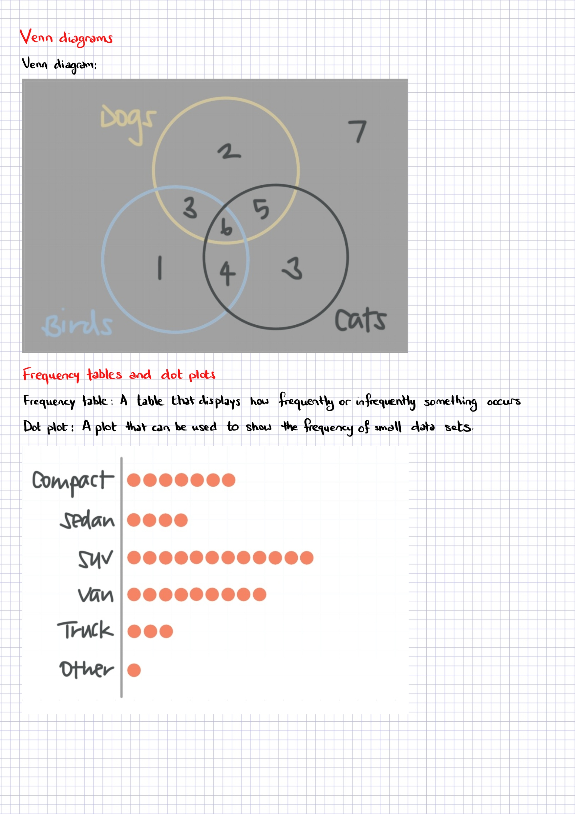

# Probability & Statistics by Krista King

# SYLLABUS

## Section 1: Getting started

## Section 2: Visualizing data

## Section 3: Analyzing data

## Section 4: Data distributions

## Section 5: Probability

## Section 6: Discrete random variables

## Section 7: Sampling

## Section 8: Hypothesis testing

## Section 9: Regression

## Section 10: Final exam and wrap-up

##